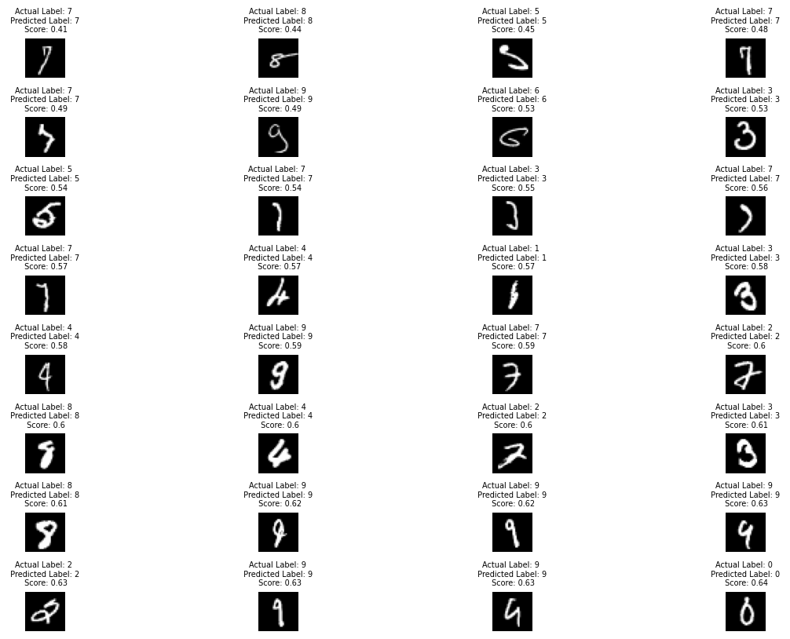

# MNIST Handwritten Digit Classification

## Objective

The MNIST dataset consists of a collection of handwritten digits from 0 to 9. The objective of this project is to train a neural network model that accurately classifies these handwritten digits into their respective classes. By leveraging machine learning techniques and computer vision, our goal is to develop a robust model capable of automatically recognizing and categorizing these digits. Although the MNIST dataset is relatively basic, it serves as a fundamental stepping stone into the world of computer vision.

## Dataset Description

The MNIST dataset is widely recognized and extensively used in the field of machine learning, particularly for image classification tasks. It comprises 60,000 training images and 10,000 testing images, with each image representing a 28x28 pixel grayscale handwritten digit.

## Results

Our trained model has demonstrated impressive performance, successfully classifying even the most challenging images. Here are some examples of images that were correctly classified by the model:

However, like any classification task, there are instances where our model struggles to make accurate predictions. Here are some images that were incorrectly classified, presenting significant challenges for comprehension:

These instances serve as important reminders that even state-of-the-art models have limitations when confronted with highly ambiguous or complex images.

Please note that the images provided above are representative samples and may not reflect the overall accuracy of the model across the entire MNIST dataset.

For more details on the project and its implementation, refer to the accompanying code and documentation.

**Note:** The images used in the example are for illustrative purposes and may not reflect the actual performance of the model.